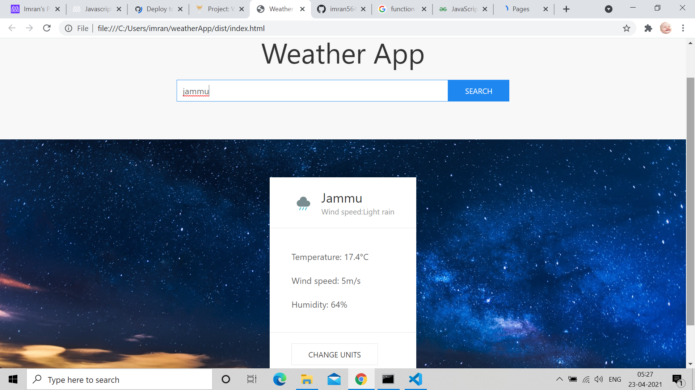

<h3 align="center">Weather APP</h3>

Weather app in JavaScript is a practice project, which includes managing the dynamically DOM manipulation and asynchronous access to public API using async await methods and promises. I used Javascript, HTML5, CSS3, Bootstrap, Open Weather API and Giphy API to implement it.

## App Screenshot

## Live Link Demo

[Live Link Demo](https://imran5644.github.io/weatherApp/)

## Built With

- HTML5
- CSS3
- UIKit framework
- Open Weather API
- JavaScript

## Getting Started

To get a local copy up and running follow these simple example steps.

### Prerequisites

- Text Editor (VSCode is suggested.)

### Setup

- Install [git](https://git-scm.com/downloads)
- Open Terminal
- Change directory to folder to download repository
- Use `cd <file-path>`
- Run `git clone https://github.com/imran5644/weatherApp.git`

To make any change,

- Open related file by using text editor.

## How do I get access of the api's?
  - visit the website (https://openweathermap.org/ or https://www.weatherbit.io/api).
  - Read the documentation. The specifics for using any API are usually documented on the service’s website.
  - Sign up for an account.
  - Use the API key provided in the account dashboard.
  - Use this Api Key in the provided url to access the server data.

## Usage
  - Add a .env file on the root folder of your project with all your API keys as the example below
  - API_KEY="'your open weather key'"
  - run npm run build on your terminal to rebuild your public keys
  - Change directory to dist folder
  - Open index.html on your preferred browser

## Author

👤  **Imran Yousaf**

- GitHub: [@imran5644](https://github.com/imran5644)
- Twitter: [@imran56444](https://twitter.com/imran56444)
- LinkedIn: [Imran Yousaf](https://www.linkedin.com/in/imranyousaf-programmer/) 

## 🤝 Contributing

Contributions, issues and feature requests are welcome! Start by:

- Forking the project
- Cloning the project to your local machine
- `cd` into the project directory
- Run `git checkout -b your-branch-name`
- Make your contributions
- Push your branch up to your forked repository
- Open a Pull Request with a detailed description to the development branch of the original project for a review

## Show your support

Give a ⭐️ if you like this project!

## Acknowledgments

- W3Schools
- Font Awesome
- Javascript

## 📝 License

This project is [MIT](LICENSE) licensed.
